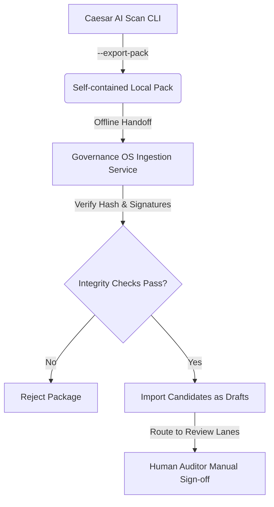

# Governance OS Integration Contract

This document outlines the technical interface contract and handoff specifications for importing `caesar-ai-scan` export packages into the central **Governance OS**.

---

## 🛠️ Ingestion Workflow

To ensure secure, audited, and compliant ingestion of static scan data, Governance OS enforces a strict four-step pipeline:

---

## 📋 Integration Specifications

### 1. Cryptographic Package Verification
Before parsing any contents, Governance OS must verify all SHA-256 hashes against `manifest.json`:
- Read `manifest.hash_summary`.
- Re-calculate SHA-256 hashes of all 5 exported JSON files (`scan-result.json`, `evidence-candidates.json`, `review-workflow.json`, `import-readiness.json`, `human-review-checklist.json`) on the ingestion server.
- The package **MUST** be rejected if any calculated hash does not match the manifest checksum.

### 2. Isolation and Staging Policies
- **Draft Status Lock:** Governance OS must strictly import all candidates as `draft` or `pending_review` staging records. No scan candidate may be directly ingested into an active `approved` state.
- **Manual Gate Enforcement:** The ingestion service must reject any export package where `import_readiness.can_import_automatically` is `true` or where `human_review_checklist.signoff_required` is `false`.

### 3. Review Lane Routing
Governance OS uses the array listed in `human_review_checklist.review_lanes` to automatically create audit review tasks and route them to corresponding corporate departments:
- **`technical_owner_review`**: Triggers technical leads to confirm designated system ownership.
- **`security_review`**: Triggers security operations to verify key management (e.g. confirming no plaintext key exposure).
- **`legal_compliance_review` & `vendor_review`**: Triggers legal assessors to check vendor commercial agreements and data protection impact assessments (DPIAs).

---

*For integration and system compatibility specifications only. No active live endpoints exist in this version.*
