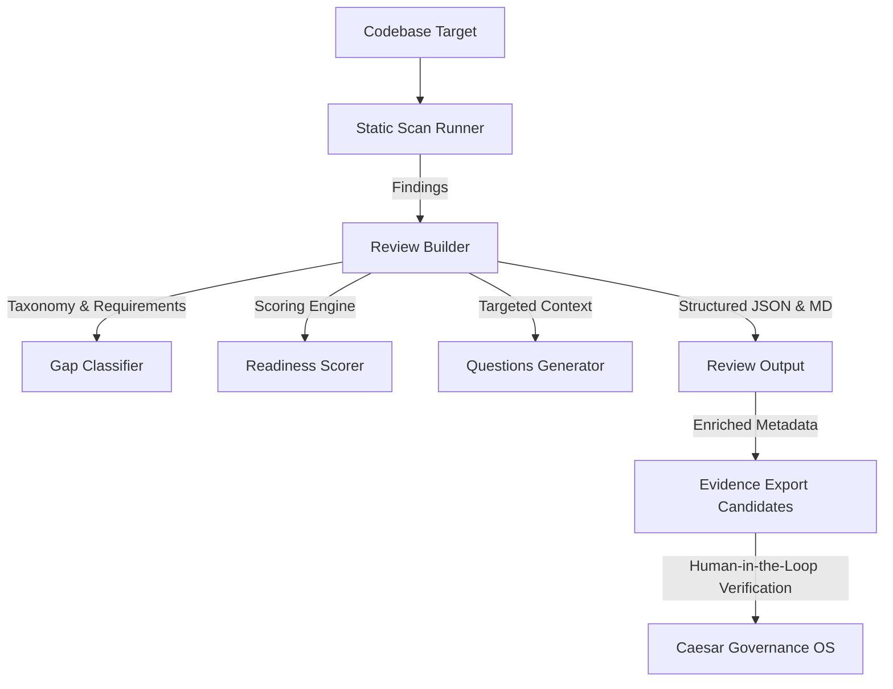

# Review Workflow and Evidence Gaps

> [!IMPORTANT]
> **Prototype System Notice**  
> Caesar AI Scan is an offline static-analysis prototype. It identifies governance review needs, not final legal conclusions. The findings generated are AI usage signals, not definitive proof of non-compliance. All evidence export candidates generated by the exporter remain in a `draft` status and require human review and cryptographic authorization before any official Caesar AI Evidence or Governance OS ingestion occurs.

This document describes the offline Review Workflow and Evidence Gap analysis system introduced in version `0.3.0` of Caesar AI Scan.

## Overview

Static code scanning is effective at identifying potential AI systems (SDKs, models, parameters, prompting structures, vector stores, environment keys), but human reviewers need structured information to act on those signals.

The review workflow acts as a bridge between static codebase signals and the Caesar Governance OS by mapping raw findings to:
1. **Assigned Review Lanes**: Cross-functional responsibilities (Legal, Security, Privacy, etc.) triggered by the finding.
2. **Evidence Gaps**: Unresolved compliance requirements (e.g. missing system owner, missing risk tier) that must be resolved before a finding is unblocked.
3. **Recommended Questions**: Targeted questions to help developers and reviewers gather the necessary context.
4. **Remediation Actions**: Practical steps to register and secure the AI asset.
5. **Export Readiness Score**: A deterministic percentage (0-100%) indicating how complete the governance evidence is.

---

## Architecture Flow

1. **Scan Runner**: Scans files and flags AI dependencies, vector DBs, env-vars, and prompts.
2. **Review Workflow Builder**: Iterates through each finding to assemble a compliance review item.
3. **Evidence Gap Classifier**: Categorizes missing evidence fields based on finding category and matched signal.
4. **Export Readiness Scorer**: Computes a deterministic readiness percentage, deducting points for outstanding gaps and applying a 70% cap if any blocking gaps exist.
5. **Enriched Candidates**: The candidate exporter embeds these gaps, readiness scores, and assigned lanes inside each candidate.
6. **Safety Gate**: All candidates remain locked in `draft` status with `review_required: true`. No automated ingestion or live integrations exist in this offline prototype.
