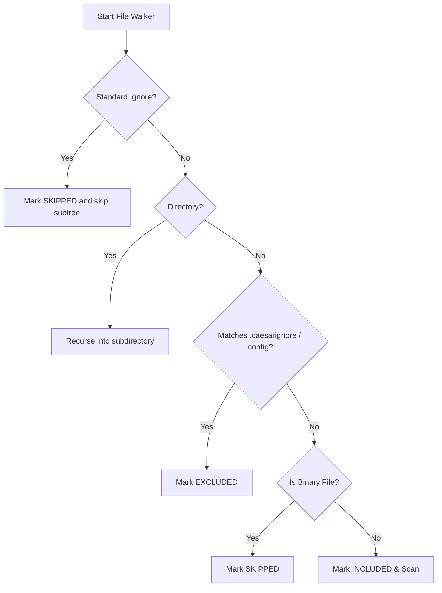

# Scope Control Guide — caesar-ai-scan

This document outlines the scope control features, configuration schemas, ignore list protocols, and execution workflows in `caesar-ai-scan` version `0.5.0`.

---

## 🚦 Overview

Scope Control provides precise filesystem visibility bounds for static-analysis scan routines. It limits parsing resources to production-relevant files while systematically bypassing noise, vendors, environment samples, and binaries.

The scope resolver divides encountered files into three distinct categories:
1. **Included (`included`):** Active code/text files scanned by detectors.
2. **Excluded (`excluded`):** Bypassed via local custom ignore rules (`.caesarignore` or configuration files).
3. **Skipped (`skipped`):** Bypassed via system standard filters (e.g. `node_modules`, `.git`) or binary type limits.

---

## 📝 Configuration Protocols

### 1. The `.caesarignore` File
Located at the root of the scanned project, this file follows a standard gitignore-like format.
* Lines starting with `#` are ignored as comments.
* Empty lines are skipped.
* Glob patterns are parsed using a custom regex engine:
  * `*` matches any character except segment separators `/`.
  * `**` matches directories recursively.
  * A leading `/` locks matching to the target directory root.
  * A trailing `/` matches directories and all files nested inside them recursively.

**Example `.caesarignore`:**
```ini
# Ignore local secrets sample
.env.example

# Ignore third-party noise files
noise_vendor/

# Ignore specific test suites
**/*.test.js
```

### 2. JSON Scan Configuration (`caesar-scan.config.json`)
The CLI automatically loads a scan config from the target or working directory. You can also specify it explicitly using `--config <path>`.

**Schema Reference:**
```json
{
  "target": ".",
  "exclude": [
    "noise_vendor/"
  ],
  "rulesPath": null,
  "outputs": {
    "scan_result": "tmp/sample-scan-result.json",
    "evidence_candidates": "tmp/sample-evidence-candidates.json",
    "review_out": "tmp/sample-review-workflow.json",
    "review_report": "tmp/sample-review-workflow.md",
    "export_pack": "tmp/sample-evidence-export-pack",
    "scope_out": "tmp/sample-scope.json",
    "scope_report": "tmp/sample-scope.md"
  }
}
```

---

## ⚙️ Path Resolution Algorithm

During traversal, path segments are checked progressively from root to leaf to ensure that if a directory is ignored, all of its nested children are bypassed without wasting CPU cycles.



---

## 📊 Scope Reports Outputs

* **Scope JSON (`--scope-out`):** Machine-readable tracking file documenting counts, lists of included, excluded, and skipped file paths, along with specific matching ignore patterns.
* **Scope Markdown (`--scope-report`):** Premium, human-readable analytics board summarizing scope bounds and rationales.
