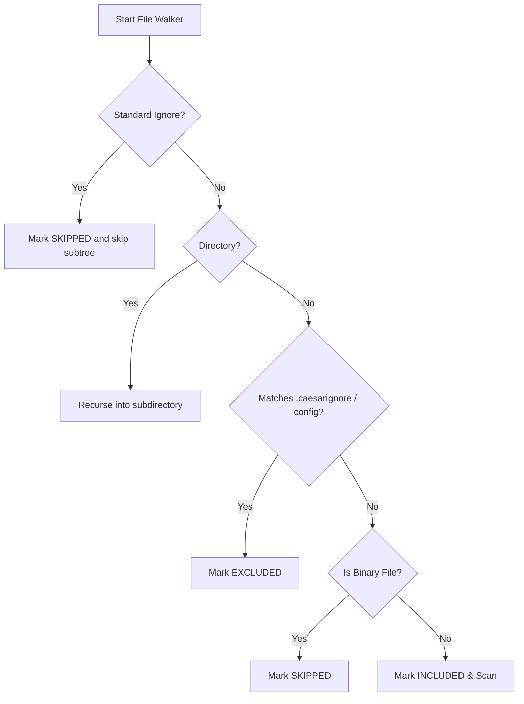

# Caesar AI Compliance: Scope Control Policy

This document defines the static-analysis scope control policy, categorization rules, and recursive directory checking algorithms in `caesar-ai-scan` version `0.5.0`.

---

## 🚦 File Categorization Policies

Every filesystem object encountered during the walker traversal is categorized into one of three strict buckets:

### 1. Included (`included`)
* **Definition:** Valid text-based source files that are actively analyzed by static-analysis detectors against compliance rules.
* **Examples:** `.js`, `.py`, `.json`, `.txt`, `.md`, `.env.example`, `requirements.txt`, `package.json`.

### 2. Excluded (`excluded`)
* **Definition:** Text files that would normally be scanned but match custom ignore boundaries defined in `.caesarignore` or custom JSON `exclude` configuration options.
* **Examples:** Mock AI files, generated tests, local noise, or temporary scratch files.

### 3. Skipped (`skipped`)
* **Definition:** Items bypassed automatically due to safety controls, binary structure, or built-in system standards.
* **Examples:**
  * **Standard Ignores:** `.git/`, `node_modules/`, `venv/`, `.venv/`, `dist/`, `build/`, `tmp/`, `.DS_Store`.
  * **Binary Extensions:** `png`, `jpg`, `jpeg`, `gif`, `ico`, `pdf`, `zip`, `tar`, `gz`, `dmg`, `exe`, `mp3`, `mp4`, `mov`, `wav`, `webp`, `woff`, `woff2`.

---

## ⚙️ Path Traversal & Ancestor Prefix Resolution

To prevent redundant filesystem access, the scanner checks all path segment prefixes progressively:
* E.g., for `src/ignored-vendor/nested/file.js`, if `src/ignored-vendor` matches an exclusion, the recursion immediately halts at that directory root.
* Subdirectories are never entered, ensuring extreme performance and eliminating unverified code ingestion from vendor directories.

### Walker Traversal Decision Workflow

